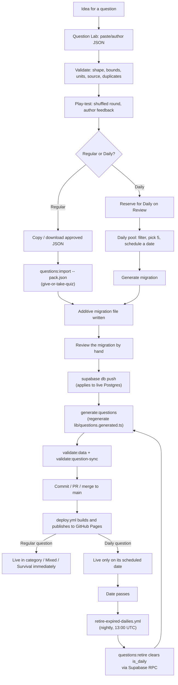

# Question pipeline: where everything lives, and how to use it

This is the map. It ties together two separate tools and two separate git
repositories that together take a question from an idea to something a
player sees. For the step-by-step of any one stage, follow the links out to
the detailed guide for that stage — this document is the overview, not a
replacement for them.

## The two places

| | give-or-take-quiz | Question Lab |
| --- | --- | --- |
| **What it is** | The live site and its Supabase backend | A standalone offline authoring and play-testing tool |
| **Repo** | This repo | [Cambo2k20/question-lab](https://github.com/Cambo2k20/question-lab) (private) — separate, no shared history with this one |
| **Connects to Supabase?** | Yes — this is the production system | No, never. It cannot write to the database |
| **Where it runs** | Deployed at <https://giveortakequiz.com/>; `npm run dev` locally for development | `npm run dev` locally only; opened from the **Question Lab** desktop shortcut day to day |
| **What you do there** | Apply migrations, regenerate the offline bank, validate, deploy | Draft questions, check them against real validation rules, play-test them, reserve and schedule Dailies |

Question Lab lives at `C:\Users\Cambo\Documents\GitHub\question-lab`,
alongside this repo, and pushes to the private GitHub repo
<https://github.com/Cambo2k20/question-lab>. It previously sat under
`.codex\visualizations\...` with no remote at all — a lost directory meant
lost work — so if you find a reference to that path anywhere, it is stale.

Its working state (drafted JSON, review selections, play-test feedback, the
Daily pool) still lives only in **one browser's local storage on one
machine**, and no remote protects that. Clearing site data for
`127.0.0.1:5193`, or switching browsers, still discards it. Export approved
JSON and generate Daily migrations promptly rather than leaving a batch
parked in the pool.

## The full lifecycle



The loop at the bottom is the part that is easy to miss: a Daily question
does not become an ordinary category question by itself. It sits reserved,
then scheduled, then played, then a **separate, unattended nightly job**
retires it and reopens the pull request that regenerates the offline bank.
Nothing about that requires a human unless the automated PR needs review —
see [Automated workflows](#automated-workflows) below.

## "I want to..."

### ...add a handful of category questions by hand

You don't need Question Lab for this. Follow
[docs/ADDING_CategoryQuestions.md](ADDING_CategoryQuestions.md) directly:
write the migration by hand, `npm run generate:questions`, `npm run
validate:data`, test in `npm run dev`, then lint/test/build.

### ...author a batch of questions with real validation and play-testing

Open Question Lab (desktop shortcut, or `npm run dev` in its own directory —
see its [README](../../question-lab/README.md) for the exact workflow).
Paste your draft JSON, load `lib/questions.generated.ts` and
`data/daily-sets.json` as reference banks for duplicate checking, validate,
verify sources, play-test, then download the approved JSON.

Bring that file back to **this** repo and run:

```bash
npm run questions:import -- path/to/approved-questions.json
```

This writes an additive migration into `supabase/migrations/`. It does not
touch the database or `lib/questions.generated.ts` — applying the migration
and regenerating stays a deliberate, separate step (below).

### ...write and schedule a new Daily

Same starting point as above, but in Question Lab's **Review** step tick
**Reserve for Daily** on each question you want held back (or **Reserve
selected for Daily** for the whole batch). Then:

1. Open **Daily pool** (step 4 in Question Lab).
2. Filter/search to find the five you want.
3. Tick exactly five, pick a date, **Schedule this daily**.
4. **Generate migration** once the draft shows 5 of 5.
5. Copy or download the SQL.

That SQL is written in the same shape as this repo's
`scripts/build-daily-sql.ts` output, so it drops into
`supabase/migrations/` unedited. Review it, then apply it the normal way
(below). Full detail: Question Lab's own README, "Building a daily" section.

### ...apply a migration to the live database

Migrations are never applied automatically by pushing to `main` — git and
Supabase deploy separately.

```bash
npx supabase login
npx supabase link --project-ref <project-ref>
npx supabase migration list   # compare local vs remote history first
npx supabase db push
```

After pushing, regenerate and validate so the bundled bank matches what
Supabase now knows:

```bash
npm run generate:questions
npm run validate:data
npm run validate:question-sync
```

Or just run `npm run questions:verify`, which does all of that plus the full
test/lint/build gate in one command.

### ...understand why a Daily question reappeared in the category pool

It didn't reappear on its own — the nightly `retire-expired-dailies.yml`
workflow ran, called `questions:retire` (a Supabase RPC, `service_role`
only), and that cleared `is_daily` on every question whose scheduled dates
had all passed. The same run regenerates the offline bank and opens a pull
request. See [Automated workflows](#automated-workflows).

### ...deploy a code change (not a question change)

Push to `main`. `deploy.yml` runs tests, builds with the production Supabase
variables, and publishes `dist/` to GitHub Pages. It does **not** touch the
database — a code deploy and a migration are independent actions, and
neither implies the other happened.

## Automated workflows

| Workflow | Trigger | What it does | Needs |
| --- | --- | --- | --- |
| `ci.yml` | Every push and PR | Lint, test, build — no deploy | Nothing beyond the checkout |
| `deploy.yml` | Push to `main`, or manual | Test, build with production Supabase config, publish to GitHub Pages | Repo variables `VITE_SUPABASE_URL`, `VITE_SUPABASE_PUBLISHABLE_KEY` |
| `retire-expired-dailies.yml` | Daily at 13:00 UTC, or manual | Retire expired Dailies via RPC, regenerate the offline bank, validate, open/update a PR | Repo variables above **plus** secret `SUPABASE_SERVICE_ROLE_KEY` |

13:00 UTC is deliberate: the last timezone to leave a given date (UTC-12)
does so at 12:00 UTC the next day, so this runs an hour after literally
nowhere on Earth is still mid-Daily for that date. Running earlier would
reopen the answer-leak the Daily bank exists to prevent.

The retirement workflow only opens a PR when something actually changed —
if no Daily expired that day, it exits quietly. When it does open one,
merging it is what actually publishes the refreshed bank; the workflow
itself only commits to its own branch.

## Full command reference (this repo)

| Command | Purpose |
| --- | --- |
| `npm run dev` | Start the local dev server |
| `npm test` / `npm run test:watch` | Run the Vitest suite |
| `npm run lint` | ESLint |
| `npm run build` | Validate, type-check, build to `dist/` |
| `npm run preview` | Serve the production build locally |
| `npm run validate:data` | Validate the regular bank and Daily schedule (no network) |
| `npm run validate:question-sync` | Require bundled and Supabase regular-question IDs to match (needs `.env`) |
| `npm run generate:questions` | Regenerate `lib/questions.generated.ts` from Supabase (needs `.env`) |
| `npm run build:daily-sql` | Regenerate `supabase/seed-daily.sql` from `data/daily-sets.json` |
| `npm run questions:import -- <pack.json>` | Turn a reviewed pack (typically a Question Lab export) into an additive migration |
| `npm run questions:retire` | Retire expired Dailies via Supabase RPC (needs `SUPABASE_SERVICE_ROLE_KEY`) |
| `npm run questions:verify` | `generate:questions` → `validate:question-sync` → `validate:data` → `test` → `lint` → `build`, in one step |

Question Lab has its own, much shorter command surface (`npm run dev`, `npm
run lint`, `npx tsc --noEmit`) — see its own README, since it is a separate
project with a separate `package.json`.

## Known rough edges

- **Question Lab's working state is still browser-local.** The repo itself is
  now backed up (private GitHub remote, see above), but the questions you are
  part-way through drafting are not: they live in one browser's local storage
  on one machine. Clearing site data loses them.
- **`data/daily-sets.json` ships the full future schedule to the browser.**
  Up to several weeks of upcoming Daily questions and answers are in the
  committed JSON, and therefore in the deployed client bundle, readable in
  devtools by anyone curious enough to look. Nothing currently prevents a
  motivated player from spoiling a future Daily this way. Pre-existing,
  unrelated to the retirement or import automation, and not fixed by either.
- **`lib/categories.ts` availability is manual.** A category crossing 20
  questions doesn't flip itself to `live` — someone edits the registry and
  commits an `activate_<category>.sql`-style migration (see
  `20260802175858_activate_dinosaurs_games.sql` for the precedent). The
  README's category table can drift from the code if that step happens
  without a documentation update alongside it — as it did until this guide
  was written.
